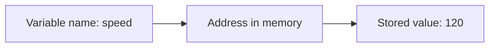

<h1 align="center">
    
    <br>
    <b>C</b>
</h1>

<div align="center">

[Home](../../../../README.md) · [C](../../README.md) · [Chapter 03](./README.md)

</div>

---

# Memory Addresses in Plain Language

> Before pointers make sense, memory addresses have to stop sounding magical.

**You will learn:**
- What a memory address represents
- Why variables live somewhere in memory
- How C lets you talk about those locations directly

**Before this page, you should know:** [Chapter 02](../02-syntax-and-control-flow/README.md)

---

## The first mental model

When your program creates a variable, the value is stored somewhere in memory.
That "somewhere" has a location.
That location is the **address**.

Think of it like this:

- value = the thing being stored
- address = where the thing is stored

## Tiny example

```c
int speed = 120;
```

This line creates a value and stores it at some address in memory.
You usually do not care about the address in beginner languages.
In C, you eventually do.

## Visual model



## Why addresses matter in C

C is closer to the machine than most beginner languages.
That means you are allowed to work with addresses, not only values.
That power is why C is useful and why C can be dangerous.

> [!IMPORTANT]
> A pointer is not the value itself. It is a way to hold or use an address.

## Seeing an address

You can ask for the address of a variable with `&`.

```c
int speed = 120;
printf("%p\n", (void *)&speed);
```

Read it slowly:
- `&speed` means "the address of `speed`"
- `%p` prints a pointer or address-like value
- `(void *)` is a cast that matches what `printf` expects for `%p`

> [!NOTE]
> Do not worry about the cast too much yet. The core idea here is that `&speed`
> gives you the address of the variable.

---

## Recap

- Variables live at addresses in memory.
- The stored value and the address are different ideas.
- `&variable` asks for the variable's address.

## Try it yourself

Declare two integers and print both addresses. Then explain why the values can
be similar or different while the addresses are still separate.

---

<div align="center">

| Previous | Up | Next |
|:---------|:--:|-----:|
| [← Chapter 02](../02-syntax-and-control-flow/README.md) | [Chapter 03](./README.md) · [C](../../README.md) · [Home](../../../../README.md) | [What a Pointer Really Stores →](./02-what-a-pointer-really-stores.md) |

</div>
