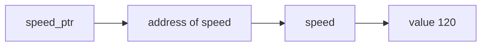

<h1 align="center">
    
    <br>
    <b>C</b>
</h1>

<div align="center">

[Home](../../../../README.md) · [C](../../README.md) · [Chapter 03](./README.md)

</div>

---

# What a Pointer Really Stores

> A pointer stores an address. That is the whole idea, and everything else grows from it.

**You will learn:**
- What a pointer variable is
- How pointer declarations read
- How to connect variable, address, and pointer in one picture

**Before this page, you should know:** [Memory Addresses in Plain Language](./01-memory-addresses-in-plain-language.md)

---

## Pointer declaration

```c
int speed = 120;
int *speed_ptr = &speed;
```

Read the second line slowly:
- `int *speed_ptr` means `speed_ptr` is a pointer to an `int`
- `&speed` means "the address of `speed`"
- so `speed_ptr` stores the address of `speed`

## Visual model



## What the `*` means here

In a declaration like `int *speed_ptr`, the `*` is part of saying:
"this variable is a pointer to an int."

Later, you will also see `*` used for dereferencing.
Same symbol, different role depending on context.

> [!WARNING]
> Beginners often memorize pointer syntax without connecting it to the address/value model. Do not skip that model.

## Plain-language translation

A pointer does not hold the integer `120` here.
It holds the location where `120` is stored.

---

## Recap

- A pointer stores an address.
- `int *ptr` means pointer to integer.
- `&variable` gives the address that can be stored in a pointer.

## Try it yourself

Declare one integer and one pointer to it. Then describe both variables in one sentence each: what value does the integer hold, and what does the pointer hold?

---

<div align="center">

| Previous | Up | Next |
|:---------|:--:|-----:|
| [← Memory Addresses in Plain Language](./01-memory-addresses-in-plain-language.md) | [Chapter 03](./README.md) · [C](../../README.md) · [Home](../../../../README.md) | [Dereferencing Without Hand-Waving →](./03-dereferencing-without-hand-waving.md) |

</div>
