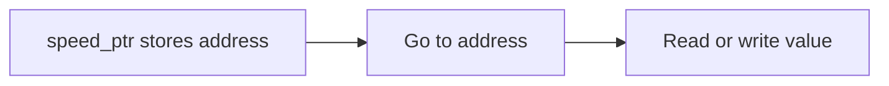

<h1 align="center">
    
    <br>
    <b>C</b>
</h1>

<div align="center">

[Home](../../../../README.md) · [C](../../README.md) · [Chapter 03](./README.md)

</div>

---

# Dereferencing Without Hand-Waving

> Dereferencing means "go to the address stored in the pointer and access the value there."

**You will learn:**
- What dereferencing does
- How `*ptr` reads in an expression
- Why pointer access can both read and write values

**Before this page, you should know:** [What a Pointer Really Stores](./02-what-a-pointer-really-stores.md)

---

## Reading through a pointer

```c
int speed = 120;
int *speed_ptr = &speed;

printf("%d\n", *speed_ptr);
```

`*speed_ptr` means:
- take the address stored in `speed_ptr`
- go to that location
- read the integer value found there

Expected output:

```text
120
```

## Writing through a pointer

```c
*speed_ptr = 150;
```

That changes the original `speed` value because the pointer still points to it.

## Visual flow



> [!IMPORTANT]
> Dereferencing is where pointers stop being abstract. This is the moment they start affecting real program state.

## Common beginner translation

- declaration: `int *ptr` = pointer to integer
- expression: `*ptr` = value at the pointed-to address

That distinction matters.

---

## Recap

- Dereferencing follows the stored address to the value.
- `*ptr` can read a value.
- `*ptr = ...` can modify the pointed-to value.

## Try it yourself

Create one integer and one pointer, print the value through the pointer, then change the value through the pointer and print the original variable again.

---

<div align="center">

| Previous | Up | Next |
|:---------|:--:|-----:|
| [← What a Pointer Really Stores](./02-what-a-pointer-really-stores.md) | [Chapter 03](./README.md) · [C](../../README.md) · [Home](../../../../README.md) | [Function Arguments and Pointers →](./04-function-arguments-and-pointers.md) |

</div>
