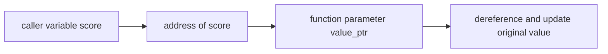

<h1 align="center">
    
    <br>
    <b>C</b>
</h1>

<div align="center">

[Home](../../../../README.md) · [C](../../README.md) · [Chapter 03](./README.md)

</div>

---

# Function Arguments and Pointers

> Pointers become immediately useful when a function needs to affect a caller's variable.

**You will learn:**
- Why ordinary function arguments are copied
- How pointers let a function work with the caller's data directly
- How pass-by-address differs from pass-by-value

**Before this page, you should know:** [Dereferencing Without Hand-Waving](./03-dereferencing-without-hand-waving.md)

---

## Value argument example

```c
void add_one(int value) {
    value = value + 1;
}
```

This changes only the local copy inside the function.
The caller's original value stays the same.

## Pointer argument example

```c
void add_one(int *value_ptr) {
    *value_ptr = *value_ptr + 1;
}
```

Call it like this:

```c
int score = 10;
add_one(&score);
```

Now the function receives the address of `score`, follows that address, and updates the original value.

## Visual model



> [!TIP]
> When a C function needs to modify the caller's variable, ask whether the function should receive a pointer.

---

## Recap

- Regular arguments are copied.
- Pointer arguments let functions reach the caller's original data.
- `&variable` passes the address, `*ptr` uses the pointed-to value.

## Try it yourself

Write a function `reset_to_zero` that accepts a pointer to `int` and sets the original value to zero.

---

<div align="center">

| Previous | Up | Next |
|:---------|:--:|-----:|
| [← Dereferencing Without Hand-Waving](./03-dereferencing-without-hand-waving.md) | [Chapter 03](./README.md) · [C](../../README.md) · [Home](../../../../README.md) | [Common Pointer Mistakes →](./05-common-pointer-mistakes.md) |

</div>
