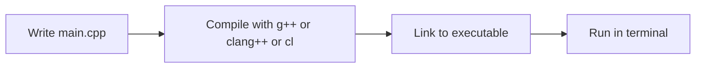

<h1 align="center">
    
    <br>
    <b>C++</b>
</h1>

<!-- ===== HEAD NAV ===== -->
<div align="center">

[Home](../../../../README.md) · [C++](../../README.md) · [Chapter 01](./README.md)

</div>

---
# Installing a C++ Compiler

Install a compiler first so all later C++ lessons run consistently.

## What a compiler does

A C++ compiler translates `.cpp` source files into machine code your OS can run.
Without a compiler, you cannot run C++ programs.

## Common compiler choices

- GCC (`g++`)
- Clang (`clang++`)
- MSVC (`cl`)

You only need one to start.

## Where to get compilers

- MSVC Build Tools (Windows): <https://visualstudio.microsoft.com/visual-cpp-build-tools/>
- LLVM/Clang downloads: <https://releases.llvm.org/download.html>
- MSYS2 (Windows package manager with GCC/Clang): <https://www.msys2.org/>

## Windows setup

### Option A: Visual Studio Build Tools (MSVC)

1. Download from <https://visualstudio.microsoft.com/visual-cpp-build-tools/>.
2. Include the "Desktop development with C++" workload.
3. Open "Developer PowerShell".
4. Run:

```bash
cl
```

If installed correctly, you should see MSVC version output.

### Option B: MinGW-w64 (GCC)

1. Install MSYS2 from <https://www.msys2.org/>.
2. Open the `MSYS2 UCRT64` shell and run:

```bash
pacman -Syu
pacman -S --needed mingw-w64-ucrt-x86_64-gcc
```

3. Open a new terminal and run:

```bash
g++ --version
```

## macOS setup

Install Xcode Command Line Tools (Apple Clang):

```bash
xcode-select --install
```

Then verify:

```bash
clang++ --version
```

## Linux setup

Install packages using your distro's package manager, then verify:

Ubuntu or Debian:

```bash
sudo apt update
sudo apt install -y build-essential clang
```

Fedora:

```bash
sudo dnf install -y gcc-c++ clang
```

Arch:

```bash
sudo pacman -S --needed gcc clang
```

Verify:

```bash
g++ --version
```

or

```bash
clang++ --version
```

## Installation checks

Run one of:

```bash
g++ --version
clang++ --version
cl
```

At least one should print version info.

## Beginner troubleshooting

- reopen terminal after install
- verify PATH updates
- check command spelling (`g++`, not `gcc` for C++)
- use one compiler consistently while learning

## Visual model



> [!IMPORTANT]
> Switching compilers every lesson adds confusion. Stay consistent until your
> C++ fundamentals are stable.
---

<!-- ===== FOOT NAV ===== -->
<div align="center">

| Previous | Up | Next |
|:---------|:--:|-----:|
| [← Chapter Start](./README.md) | [Chapter](./README.md) · [Track](../../README.md) · [Home](../../../../README.md) | [Your First C++ Program →](./02-your-first-cpp-program.md) |

</div>