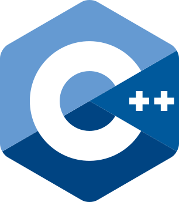

<h1 align="center">
    
    <br>
    <b>C++</b>
</h1>

[Home](../../../../README.md) / [C++](../../README.md) / [Chapter 05](./README.md)

---

# Chapter 05 Capstone Project: Inventory App

> This capstone is your first small C++ project that feels like software instead
> of isolated syntax. You will split code into files, write tests, compile with
> strict warnings, and explain ownership choices.

**You will build:**
- a small inventory library
- a command-line demo
- no-framework tests
- strict build commands
- optional sanitizer run
- a short design note

---

## Final Project Shape

```text
inventory-app/
  inventory.hpp
  inventory.cpp
  main.cpp
  inventory_tests.cpp
```

No CMake required yet. You will compile directly so the build steps stay visible.

---

## Step 1: Write The Header

`inventory.hpp`:

```cpp
#pragma once

#include <string>
#include <vector>

class Inventory {
public:
    bool add(std::string name, int quantity);
    bool sell_one(const std::string& name);
    int quantity_of(const std::string& name) const;
    int item_count() const;
    void remove_sold_out();
    std::vector<std::string> names() const;

private:
    struct Item {
        std::string name;
        int quantity;
    };

    Item* find_item(const std::string& name);
    const Item* find_item(const std::string& name) const;

    std::vector<Item> items_;
};
```

Design notes:

```text
Inventory owns a vector of Item values.
No heap allocation is needed.
find_item returns a borrowed pointer because the result may be missing.
nullptr means not found.
```

---

## Step 2: Implement The Library

`inventory.cpp`:

```cpp
#include "inventory.hpp"

#include <algorithm>
#include <utility>

bool Inventory::add(std::string name, int quantity) {
    if (name.empty() || quantity < 0) {
        return false;
    }

    if (find_item(name) != nullptr) {
        return false;
    }

    items_.push_back(Item{std::move(name), quantity});
    return true;
}

bool Inventory::sell_one(const std::string& name) {
    Item* item = find_item(name);

    if (item == nullptr || item->quantity <= 0) {
        return false;
    }

    --item->quantity;
    return true;
}

int Inventory::quantity_of(const std::string& name) const {
    const Item* item = find_item(name);

    if (item == nullptr) {
        return 0;
    }

    return item->quantity;
}

int Inventory::item_count() const {
    return static_cast<int>(items_.size());
}

void Inventory::remove_sold_out() {
    auto new_end = std::remove_if(
        items_.begin(),
        items_.end(),
        [](const Item& item) {
            return item.quantity == 0;
        }
    );

    items_.erase(new_end, items_.end());
}

std::vector<std::string> Inventory::names() const {
    std::vector<std::string> result;
    result.reserve(items_.size());

    for (const Item& item : items_) {
        result.push_back(item.name);
    }

    return result;
}

Inventory::Item* Inventory::find_item(const std::string& name) {
    for (Item& item : items_) {
        if (item.name == name) {
            return &item;
        }
    }

    return nullptr;
}

const Inventory::Item* Inventory::find_item(const std::string& name) const {
    for (const Item& item : items_) {
        if (item.name == name) {
            return &item;
        }
    }

    return nullptr;
}
```

Notice:

- `inventory.cpp` includes its own header first
- `std::move` is used only when taking ownership of the incoming name
- `find_item` has const and non-const versions
- no `new`
- no `delete`

---

## Step 3: Write The Demo App

`main.cpp`:

```cpp
#include "inventory.hpp"

#include <iostream>
#include <string>

void print_inventory(const Inventory& inventory) {
    std::cout << "Inventory:\n";

    for (const std::string& name : inventory.names()) {
        std::cout << "- " << name
                  << ": " << inventory.quantity_of(name) << '\n';
    }
}

int main() {
    Inventory inventory;

    inventory.add("Keyboard", 2);
    inventory.add("Mouse", 1);
    inventory.add("Monitor", 0);

    print_inventory(inventory);

    std::cout << "\nSelling Mouse...\n";
    inventory.sell_one("Mouse");

    std::cout << "\nRemoving sold-out items...\n";
    inventory.remove_sold_out();

    print_inventory(inventory);
}
```

Build:

```bash
g++ -std=c++20 -Wall -Wextra -Wpedantic -g main.cpp inventory.cpp -o inventory
./inventory
```

---

## Step 4: Write Tests

`inventory_tests.cpp`:

```cpp
#include "inventory.hpp"

#include <cassert>
#include <iostream>

void test_add_valid_item() {
    Inventory inventory;

    bool ok = inventory.add("Keyboard", 2);

    assert(ok);
    assert(inventory.item_count() == 1);
    assert(inventory.quantity_of("Keyboard") == 2);
}

void test_reject_empty_name() {
    Inventory inventory;

    bool ok = inventory.add("", 2);

    assert(!ok);
    assert(inventory.item_count() == 0);
}

void test_reject_negative_quantity() {
    Inventory inventory;

    bool ok = inventory.add("Keyboard", -1);

    assert(!ok);
    assert(inventory.item_count() == 0);
}

void test_reject_duplicate_name() {
    Inventory inventory;

    assert(inventory.add("Keyboard", 2));
    assert(!inventory.add("Keyboard", 5));
    assert(inventory.quantity_of("Keyboard") == 2);
}

void test_sell_one() {
    Inventory inventory;

    assert(inventory.add("Mouse", 2));
    assert(inventory.sell_one("Mouse"));
    assert(inventory.quantity_of("Mouse") == 1);
}

void test_sell_missing_item() {
    Inventory inventory;

    assert(!inventory.sell_one("Missing"));
}

void test_remove_sold_out() {
    Inventory inventory;

    assert(inventory.add("Keyboard", 1));
    assert(inventory.add("Mouse", 0));
    assert(inventory.sell_one("Keyboard"));

    inventory.remove_sold_out();

    assert(inventory.item_count() == 0);
}

int main() {
    test_add_valid_item();
    test_reject_empty_name();
    test_reject_negative_quantity();
    test_reject_duplicate_name();
    test_sell_one();
    test_sell_missing_item();
    test_remove_sold_out();

    std::cout << "all inventory tests passed\n";
}
```

Build tests:

```bash
g++ -std=c++20 -Wall -Wextra -Wpedantic -g inventory_tests.cpp inventory.cpp -o inventory_tests
./inventory_tests
```

---

## Step 5: Run A Strict Gate

After the project works, run a warnings-as-errors check.

```bash
g++ -std=c++20 -Wall -Wextra -Wpedantic -Werror -g main.cpp inventory.cpp -o inventory
g++ -std=c++20 -Wall -Wextra -Wpedantic -Werror -g inventory_tests.cpp inventory.cpp -o inventory_tests
```

If this fails, fix the warning instead of hiding it.

---

## Step 6: Optional Sanitizer Gate

If your compiler supports sanitizers:

```bash
g++ -std=c++20 -g -O1 -fsanitize=address,undefined -fno-omit-frame-pointer main.cpp inventory.cpp -o inventory_san
./inventory_san

g++ -std=c++20 -g -O1 -fsanitize=address,undefined -fno-omit-frame-pointer inventory_tests.cpp inventory.cpp -o inventory_tests_san
./inventory_tests_san
```

Expected result:

```text
No sanitizer errors.
Tests pass.
```

---

## Step 7: Write A Design Note

Create a short `DESIGN.md`:

```md
# Inventory App Design

## Ownership

Inventory owns a vector of Item values. Item is stored by value because each item
is small and there is no polymorphic ownership requirement.

## Borrowing

find_item returns a raw pointer internally because the result may be missing.
The pointer is non-owning and must not be deleted.

## Validation

add rejects empty names, negative quantities, and duplicate names.
sell_one rejects missing items and sold-out items.

## Build Gates

The app and tests build with strict warnings. Sanitizers are used when available.
```

This turns your code choices into explainable engineering choices.

---

## Reviewer Checklist

Before calling the project done:

- app builds cleanly
- tests build cleanly
- tests pass
- strict warnings pass
- sanitizer run is clean when available
- no manual `new`
- no manual `delete`
- ownership choices are documented
- invalid input is handled with normal control flow
- assertions are used only in tests or programmer-assumption checks

---

## Common Improvements

After the capstone works, try:

- case-insensitive item lookup
- command loop with user input
- save/load from a text file
- replace no-framework tests with a real test framework
- add CMake
- split `Item` into its own public class if the design grows

Do not add all improvements at once. Add one behavior, test it, then continue.

---

## Course Sign-Off

If you can build this project and explain every choice, you have crossed an
important beginner C++ line.

You can now:

- define classes with protected invariants
- use constructors to create valid objects
- use `const` correctly
- choose values before pointers
- explain ownership
- use RAII containers
- write tests
- compile with strict warnings
- debug compiler messages
- run sanitizer checks when available

That is real C++ foundation, not syntax theater.

---

[**Next ->** Track Overview](../../README.md)  
[**<- Previous** Sanitizers And Memory-Issue Triage](./04-sanitizers-and-memory-issue-triage.md)
