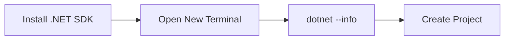

<h1 align="center">
    
    <br>
    <b>C#</b>
</h1>

<!-- ===== HEAD NAV ===== -->
<div align="center">

[Home](../../../../README.md) · [C#](../../README.md) · [Chapter 01](./README.md)

</div>

---

# Installing the .NET SDK

> Install the .NET SDK correctly once so every later C# lesson works without toolchain confusion.

**You will learn:**
- Where to install .NET from official sources
- How to verify your install from the terminal
- How to fix the most common setup failures

**Before this page, you should know:** terminal basics and basic file navigation.

---

## Install and verify

Download from the official page: <https://dotnet.microsoft.com/download>.

Install the latest stable SDK for your OS. Then open a new terminal and run:

```bash
dotnet --info
dotnet --list-sdks
```

You should see installed SDK versions and runtime details.

If `dotnet --list-sdks` returns no SDKs, you likely installed only the runtime.

## OS-specific quick paths

Windows:
- Use the official installer from Microsoft.
- Reopen terminal after installation.

macOS:
- Install the SDK package from Microsoft.
- Reopen terminal and verify the SDK list.

Linux:
- Follow the distro-specific repo instructions from Microsoft docs.
- Install SDK package, not just runtime package.

## Verify with one real project

Run this to prove your toolchain is fully usable:

```bash
dotnet new console -n sdk-check
cd sdk-check
dotnet build
dotnet run
```

Expected result: a successful build and terminal output from the template app.

Windows note:
- Restart terminal after install so PATH updates are applied.

macOS note:
- If command is not found after install, restart terminal or log out/in.

Linux note:
- Prefer Microsoft docs for distro-specific repository setup.

## Common failures and fixes

- `dotnet: command not found`
Cause: PATH/session issue.
Fix: close all terminals and open a new one.

- `No .NET SDKs were found`
Cause: runtime-only install.
Fix: install SDK from official downloads page.

- Build works in one terminal but not another
Cause: mixed shell environments.
Fix: standardize on one shell while learning.

## Visual model



> [!IMPORTANT]
> Install the SDK, not only the runtime. The runtime runs apps, but the SDK builds and tests them.

---

## Recap

- Install from the official .NET download page.
- Verify with `dotnet --info` and `dotnet --list-sdks`.
- Restart terminal after installation to avoid false "not found" errors.

## Try it yourself

Run `dotnet --version` and write down the SDK version you installed.

---

<!-- ===== FOOT NAV ===== -->
<div align="center">

| Previous | Up | Next |
|:---------|:--:|-----:|
| [← Chapter Start](./README.md) | [Chapter](./README.md) · [Track](../../README.md) · [Home](../../../../README.md) | [Your First C# Program →](./02-your-first-csharp-program.md) |

</div>
