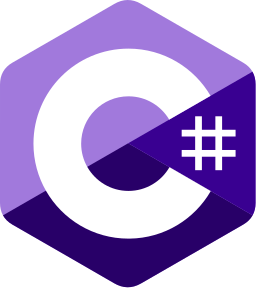

<h1 align="center">
    
     
    <b>C#</b>
</h1>

<!-- ===== HEAD NAV ===== -->

[Home](../../../../README.md) · [C#](../../README.md) · [Chapter 02](./README.md)

---

# Chapter 02 Checkpoint

> Confirm your core syntax is strong before moving into object-oriented design.

## You should be able to do all of this

- Declare and initialize common primitive and string types
- Write methods with clear signatures and return types
- Choose between `if`, ternary, and switch expressions
- Use `for` and `foreach` intentionally

## Short challenge

Implement `DescribeOrderTotal(decimal total)`:
- return `"Small"` for totals below 50
- return `"Medium"` for 50-199.99
- return `"Large"` for 200 and above

Use a switch expression.

---

## Recap

- Type choices and method signatures drive program clarity.
- Condition and loop patterns should be intentional.
- Readable names are not optional in professional code.

## Try it yourself

Take a previous exercise and refactor variable and loop names to be more descriptive.

---

<!-- ===== FOOT NAV ===== -->

| Previous | Up | Next |
|:---------|:--:|-----:|
| [← Loops and Iteration Patterns](./04-loops-and-iteration-patterns.md) | [Chapter](./README.md) · [Track](../../README.md) · [Home](../../../../README.md) | [Classes and OOP →](../03-classes-and-oop/README.md) |

