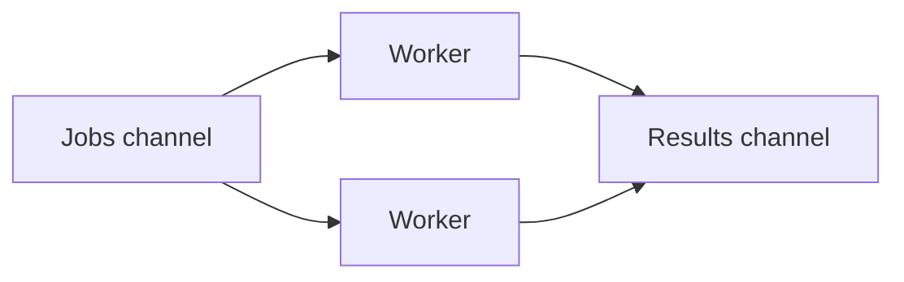

<h1 align="center">
    
     
    <b>Go</b>
</h1>

[Home](../../../../README.md) · [Go](../../README.md) · [Chapter 05](./README.md)

---

# A Small Worker Pattern

> A worker pattern gives repeated jobs to one or more goroutines in a controlled way.

**You will learn:**
- What a worker pattern is trying to solve
- Why channels often sit in the middle of the design
- How to think about jobs flowing through a system

**Before this page, you should know:** [Common Concurrency Mistakes](./03-common-concurrency-mistakes.md)

---

## Simple flow

## Why this pattern matters

It gives concurrency some structure.
Instead of random goroutines everywhere, work has a path.

## Beginner-safe lesson

Understand the flow before writing the code.
If you cannot explain where jobs start, where they go, and where results end up,
you are not ready to implement the pattern yet.

---

## Recap

- Worker patterns coordinate repeated jobs.
- Channels often connect job producers and workers.
- Diagrams can make concurrent flow much easier to reason about.

## Try it yourself

Draw a worker pattern for processing a list of filenames and returning status results.

---

| Previous | Up | Next |
|:---------|:--:|-----:|
| [← Common Concurrency Mistakes](./03-common-concurrency-mistakes.md) | [Chapter 05](./README.md) · [Go](../../README.md) · [Home](../../../../README.md) | [Project Tutorials and Next Steps →](./05-project-tutorials-and-next-steps.md) |

