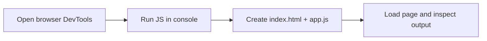

<h1 align="center">
    
    <br>
    <b>JavaScript</b>
</h1>

<!-- ===== HEAD NAV ===== -->
<div align="center">

[Home](../../../../README.md) · [JavaScript](../../README.md) · [Chapter 01](./README.md)

</div>

---

# Setting Up a JavaScript Practice Environment

> Configure a simple JavaScript practice environment without requiring a server-side runtime.

**You will learn:**
- How to run JavaScript in browser developer tools
- How to run JavaScript from a local HTML file
- How to choose a stable practice workflow

**Before this page, you should know:** terminal basics and navigating folders.

---

## Browser-based setup

Use a modern browser (Chrome, Edge, Firefox, or Safari) and open Developer Tools.

Console workflow:
1. open Developer Tools
2. select Console tab
3. type JavaScript expressions and run them

Example:

```javascript
console.log("hello from browser console");
```

## File-based setup

Create `index.html`:

```html
<!doctype html>
<html>
  <body>
    <script src="app.js"></script>
  </body>
</html>
```

Create `app.js`:

```javascript
console.log("hello from app.js");
```

Open `index.html` in your browser and view output in Developer Tools Console.

## Visual model



> [!IMPORTANT]
> Choose one consistent environment for this track and stick to it while learning.

---

## Recap

- Use browser Developer Tools to run JavaScript quickly.
- Use `index.html` + `app.js` for file-based practice.
- Keep one consistent local workflow during the basics.

## Try it yourself

Create `app.js`, print your name, and verify it appears in browser console.

---

<!-- ===== FOOT NAV ===== -->
<div align="center">

| Previous | Up | Next |
|:---------|:--:|-----:|
| [← Chapter Start](./README.md) | [Chapter](./README.md) · [Track](../../README.md) · [Home](../../../../README.md) | [Your First JavaScript Program →](./02-your-first-javascript-program.md) |

</div>
