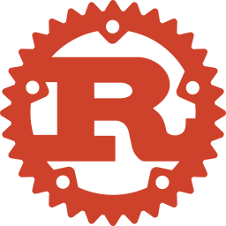

<!-- LOGO: replace with the Rust logo once added to _assets/logos/rust.svg -->

# Rust

[← Languages](../README.md) · [Academy Home](../../README.md)

---

A systems programming language focused on safety, speed, and reliability. This
track takes you from installing Rust to writing real, correct programs — without
hand-waving the parts that make Rust *Rust* (ownership, borrowing, lifetimes).

If you've never programmed at all, read [Foundations](../../foundations/) first.

## Course

Learn Rust in order.

| Chapter | Title |
|---------|-------|
| 01 | [Getting Started](./course/01-getting-started/) |

*(More chapters coming.)*

## Reference

Look things up fast.

- [Reference Index](./reference/) — syntax and quick lookups.

---

<a href="../README.md">Languages</a> · <a href="../../README.md">Academy Home</a>

