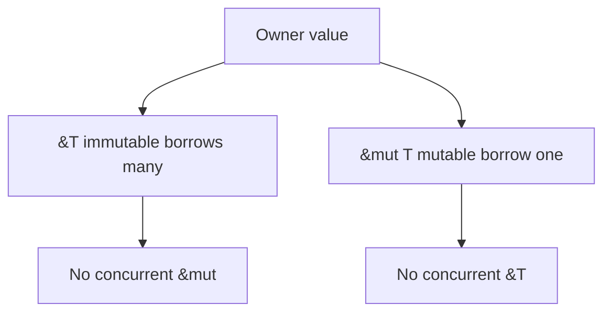

<h1 align="center">
    
    <br>
    <b>Rust</b>
</h1>

<div align="center">

[Home](../../../../README.md) · [Rust](../../README.md) · [Chapter 02](./README.md)

</div>

---

# Borrowing and References

> Borrowing lets you use data without taking ownership.

**You will learn:**
- Immutable and mutable references
- Borrowing rules and aliasing safety
- How borrowing prevents data races

**Before this page, you should know:** [Ownership: The One-Owner Rule](./02-ownership-the-one-owner-rule.md)

---

## Borrowing without owning

```rust
fn print_name(name: &String) {
    println!("{}", name);
}

fn main() {
    let car = String::from("Banshee");
    print_name(&car);
    println!("{}", car); // still valid
}
```

`&car` creates a reference; ownership stays in `car`.

## Mutable borrow

```rust
fn boost(speed: &mut i32) {
    *speed += 10;
}

fn main() {
    let mut speed = 50;
    boost(&mut speed);
    println!("{}", speed);
}
```

## Borrowing rule that matters

At one time, you can have:
- any number of immutable references, or
- exactly one mutable reference

Not both at the same time.



This blocks simultaneous read/write aliasing bugs.

> [!WARNING]
> Most beginner borrow-checker errors are overlapping references with scopes
> that are wider than intended.

> [!NOTE]
> Common compiler translation:
> - `E0499` usually means you attempted multiple mutable borrows at once.
> - Fix by narrowing the scope of the first borrow or restructuring the code
>   so only one mutable reference exists at a time.

---

## Recap

- Borrowing lets code use data without ownership transfer.
- `&T` is shared immutable access.
- `&mut T` is exclusive mutable access.

## Try it yourself

Write two functions: one reads `&String`, another updates `&mut String`, and
call them in a sequence that satisfies borrow rules.

## Reviewer checklist

- Can the learner explain why `&T` and `&mut T` cannot overlap freely?
- Can they describe the difference between owner and borrower?
- Can they locate the scope that should be narrowed in a borrow-check failure?

---

<div align="center">

| Previous | Up | Next |
|:---------|:--:|-----:|
| [← Ownership: The One-Owner Rule](./02-ownership-the-one-owner-rule.md) | [Chapter 02](./README.md) · [Rust](../../README.md) · [Home](../../../../README.md) | [Lifetimes in Plain Language →](./04-lifetimes-in-plain-language.md) |

</div>
