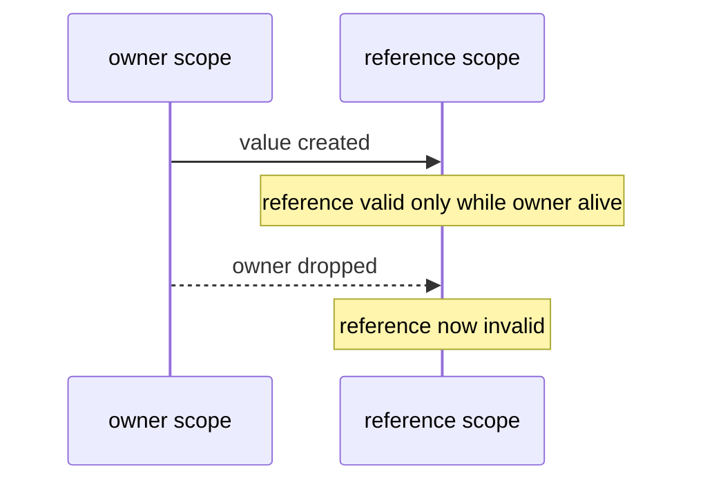

<h1 align="center">
    
    <br>
    <b>Rust</b>
</h1>

<div align="center">

[Home](../../../../README.md) · [Rust](../../README.md) · [Chapter 02](./README.md)

</div>

---

# Lifetimes in Plain Language

> Lifetimes describe how long references are valid.

**You will learn:**
- Why lifetimes exist
- Lifetime annotations for returned references
- How lifetimes connect to ownership scopes

**Before this page, you should know:** [Borrowing and References](./03-borrowing-and-references.md)

---

## Mental model

A reference must never outlive the value it points to.
Lifetimes express that relationship.



## Typical function case

```rust
fn longer<'a>(a: &'a str, b: &'a str) -> &'a str {
    if a.len() >= b.len() { a } else { b }
}
```

`'a` means returned reference is valid no longer than both inputs.

## Backend intuition

Lifetime annotations do not change runtime behavior.
They provide compile-time constraints for reference validity.

> [!NOTE]
> Common compiler translation:
> - lifetime errors often mean a reference is trying to outlive the value it points to
> - fix by making the owner live longer, returning owned data, or tightening the borrow scope

> [!TIP]
> Start by tying output lifetime to input lifetimes. Avoid over-annotating until needed.

---

## Recap

- Lifetimes prevent dangling references.
- They encode reference validity relationships.
- Lifetime annotations guide the borrow checker for complex signatures.

## Try it yourself

Write a function that returns the first of two `&str` values and annotate
lifetimes correctly.

## Reviewer checklist

- Can the learner explain why references need lifetimes?
- Can they identify the owner that must outlive the reference?
- Can they state whether returning owned data is easier than returning a reference?

---

<div align="center">

| Previous | Up | Next |
|:---------|:--:|-----:|
| [← Borrowing and References](./03-borrowing-and-references.md) | [Chapter 02](./README.md) · [Rust](../../README.md) · [Home](../../../../README.md) | [Structs, Enums, and Pattern Matching →](./05-structs-enums-and-pattern-matching.md) |

</div>
