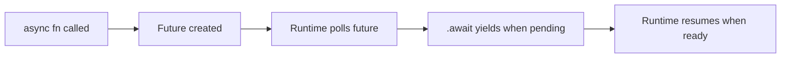

<h1 align="center">
    
     
    <b>Rust</b>
</h1>

[Home](../../../../README.md) · [Rust](../../README.md) · [Chapter 04](./README.md)

---

# Async and Await Mental Model

> Async in Rust is cooperative task scheduling, not magic parallelism.

**You will learn:**
- What async functions return
- How `.await` yields control
- Runtime role in driving futures

**Before this page, you should know:** [Threads, Shared State, and Channels](./02-threads-shared-state-and-channels.md)

---

## Key model

An `async fn` returns a future (a state machine) that does nothing until polled
by an async runtime.

## Why this matters

- async handles high-concurrency I/O efficiently
- it is not automatically multi-threaded CPU acceleration

## `.await` behavior

`.await` can pause current task and allow runtime to execute other tasks.

> [!IMPORTANT]
> Async requires a runtime in real applications. Standard library alone does not
> provide a full executor for production use.

---

## Recap

- Async Rust is future-based and runtime-driven.
- `.await` is a suspension point, not blocking thread sleep.
- Choose async for I/O-heavy concurrency patterns.

## Try it yourself

Draw a timeline showing two async tasks yielding and resuming while one thread
stays responsive.

---

| Previous | Up | Next |
|:---------|:--:|-----:|
| [← Threads, Shared State, and Channels](./02-threads-shared-state-and-channels.md) | [Chapter 04](./README.md) · [Rust](../../README.md) · [Home](../../../../README.md) | [Async Error Handling, Timeouts, and Cancellation →](./04-async-error-timeouts-and-cancellation.md) |

