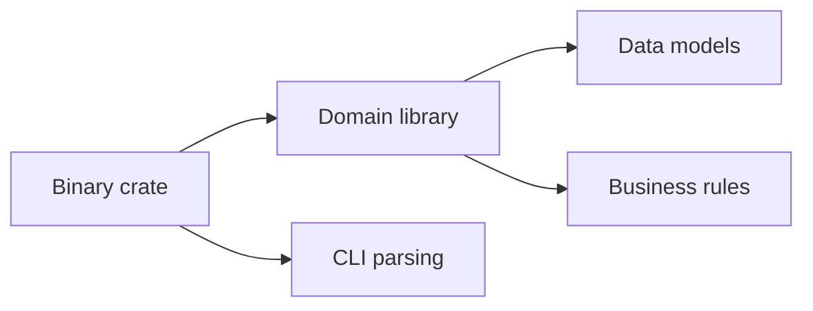

<h1 align="center">
    
     
    <b>Rust</b>
</h1>

[Home](../../../../README.md) · [Rust](../../README.md) · [Chapter 05](./README.md)

---

# Modular Design and Codebase Cleanliness

> Good Rust engineering is mostly about keeping boundaries clean and responsibilities narrow.

**You will learn:**
- How to keep codebase modular
- How to spot architecture smells early
- How to guide growth without making a mess

**Before this page, you should know:** [Binary Crates: Applications and Entry Points](./04-binary-crates-applications-and-entry-points.md)

---

## Clean codebase habits

- one module, one responsibility
- one public type/function when possible
- avoid circular dependencies
- keep tests near behavior boundaries
- separate domain logic from I/O

## Architecture smell examples

- giant `main.rs`
- modules that know too much about each other
- public API exposing internals
- duplicated logic across crates

> [!TIP]
> If you have to explain a file by saying "it does a bit of everything," it probably needs to be split.

## Visual boundary sketch

---

## Recap

- Clean Rust systems have explicit boundaries.
- Keep domain logic reusable and thinly wrapped by applications.
- Architecture grows best when responsibilities stay obvious.

## Try it yourself

Draw a module map for one project and identify where the public API should end.

---

| Previous | Up | Next |
|:---------|:--:|-----:|
| [← Binary Crates: Applications and Entry Points](./04-binary-crates-applications-and-entry-points.md) | [Chapter 05](./README.md) · [Rust](../../README.md) · [Home](../../../../README.md) | [Chapter 05 Project Tutorials →](./06-chapter-05-project-tutorials.md) |

